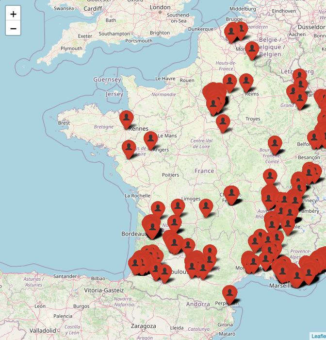

Carte de distribution de la punaise diabolique en France
================

La carte indique les signalements valides reçus sur l’application
<a href="https://rossi-jp.github.io/crises/agiir.html" target="_blank">AGIIR</a>
entre 2014 et décembre 2019. Cliquez sur les icônes pour visualiser des
informations complémentaires.

<!-- OK mais lourd -->

<!-- -->

Jean-Claude Streito, Marguerite Chartois & Jean-Pierre Rossi

## Références bibliographiques

- Chartois, M., Streito, J.-C., Pierre, É., Armand, J.-M., Gaudin, J.,
  Rossi, J.-P., 2021. A crowdsourcing approach to track the expansion of
  the brown marmorated stinkbug *Halyomorpha halys* (Stål, 1855) in
  France. BDJ 9, e66335. <https://doi.org/10.3897/BDJ.9.e66335>

- Streito, J.-C., Chartois, M., Pierre, É., Dusoulier, F., Armand,
  J.-M., Gaudin, J., Rossi, J.-P., 2021. Citizen science and niche
  modeling to track and forecast the expansion of the brown marmorated
  stinkbug *Halyomorpha halys* (Stål, 1855). Scientific Reports
  11, 11421. <https://doi.org/10.1038/s41598-021-90378-1>
